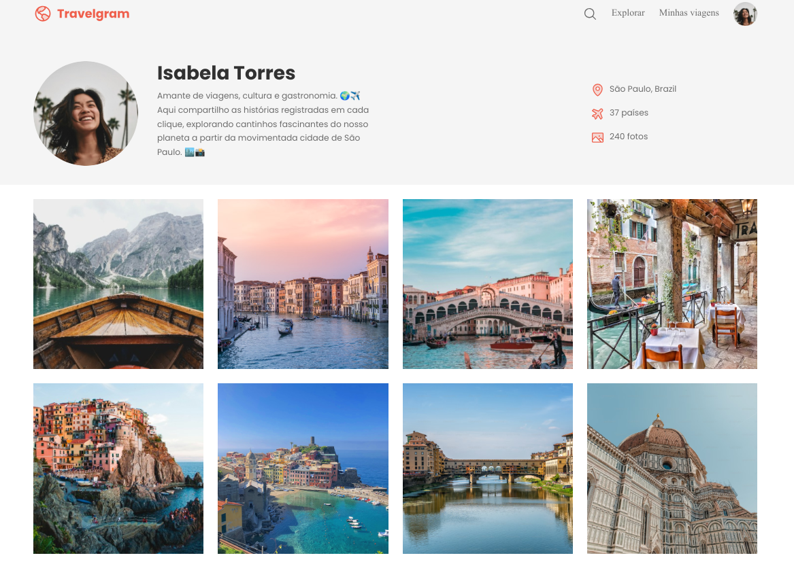

# Travelgram - Página de Perfil de Rede Social de Viagens

## Descrição

Travelgram é um projeto simples de HTML e CSS criado para praticar o uso de Flexbox. Este projeto representa uma página de perfil de uma rede social de viagens fictícia chamada de Travelgram, onde os usuários podem compartilhar suas experiências de viagem, fotos e informações pessoais.

## Captura de tela

